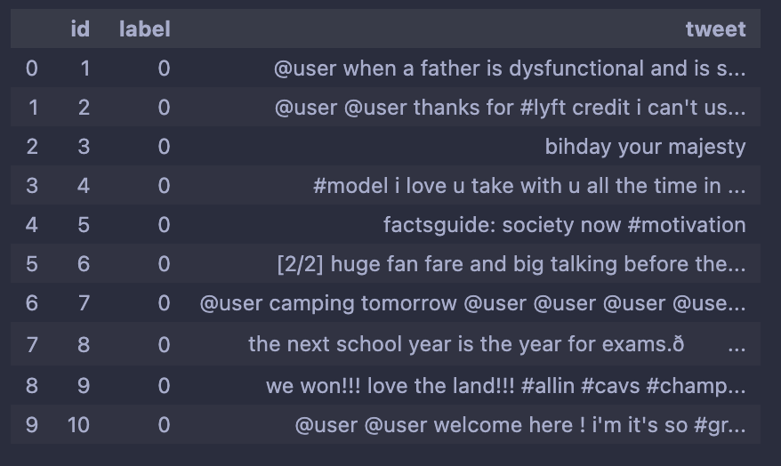
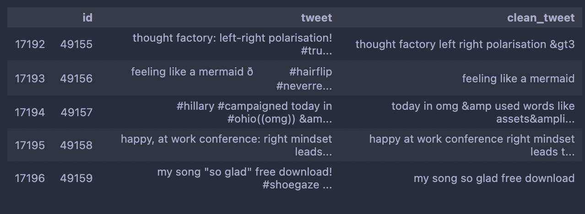
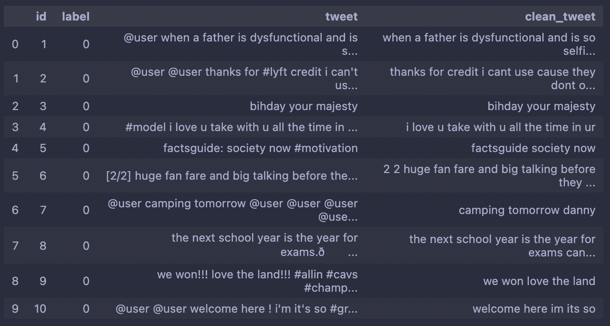
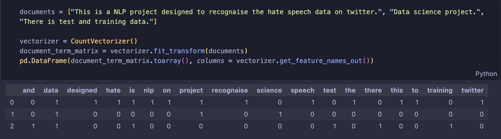

# Twitter Sentiment Analysis

**Goal**
Analysing the tweet sentiment to build a model that classifies the hate sentiment tweets.

**Data Exploration**
Taking the look at the provided traning data and test data, we can observe that:

- There exist special characters like @, #, !, and etc. We will need to remove these charactersusing a data cleaning step. 
- There were no missing values for both training and test data.

**Data Cleaning**
- We will clean the data using the tweet-preprocessor library.
- This library removes URLs, Hashtags, Mentions, Reserved words (RT, FAV), Emojis, and Smileys.
- We will also use the regular expression library to remove other special cases that the tweet-preprocessor library didn't have.
  
  
  
  
**Train and Test Split**
- Now that we have cleaned our data, we will do the test and train split using the train_test_split function.
- We will use 70% of the data as the training data and the remaining 30% as the test data.

**Vectorize Tweets using CoutVectorizer**
- Now, we will convert text into numeric form as our model won't be able to understand the human language. We will vectorize the tweets using CountVectorizer. CountVectorizer provides a simple way to both tokenize a collection of text documents and build a vocabulary of known words. 
- CountVectorizer combines all the documents and tokenizes them. Then it counts the number of occurrences from each document. 

            
**Model Building**
- Now with all tweets vectorized, we will build a model to classify the test data. 
- We will use a supervised learning algorithm, Support Vector Classifier (SVC). It is widely used for binary classifications and multi-class classifications.

**Accuracy**
- And here we go! The accuracy turned out to be (~)94%!
